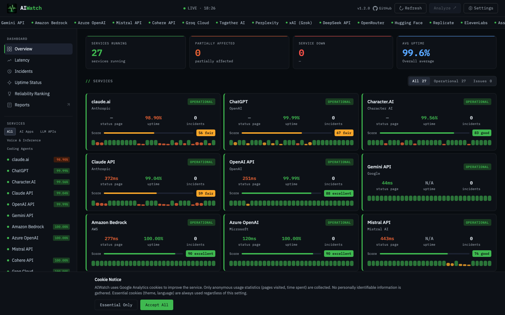

# AIWatch

[](LICENSE)
[](https://ai-watch.dev)
[](https://github.com/bentleypark/aiwatch/stargazers)
[](https://github.com/bentleypark/aiwatch/commits/main)

[English](README.md) | **한국어**

**19개 AI 서비스**의 상태, 지연시간, 가동률, 인시던트를 실시간으로 모니터링하는 대시보드입니다.

**[https://ai-watch.dev](https://ai-watch.dev)**



## 주요 기능

- **실시간 상태 모니터링** — 19개 AI 서비스의 정상 / 성능 저하 / 장애 상태
- **지연시간 측정** — API 서비스별 상태 페이지 응답 시간
- **인시던트 이력** — 다양한 상태 페이지 형식의 타임라인 상세 정보
- **가동률 추적** — Cloudflare KV를 통한 일별 가동률 누적
- **Discord 알림** — 서비스 장애 시 자동 알림
- **다크/라이트 테마** — 시스템 설정 감지 + 수동 전환
- **한국어/영어** — 이중 언어 지원
- **모바일 반응형** — 사이드바 오버레이, 모바일 액션 바

## 모니터링 서비스

### AI API 서비스 (13개)

| 서비스 | 제공업체 | 상태 소스 |
|--------|----------|-----------|
| Claude API | Anthropic | Atlassian Statuspage |
| OpenAI API | OpenAI | incident.io (Atlassian 호환) |
| Gemini API | Google | Google Cloud incidents.json |
| Mistral API | Mistral AI | Instatus (Nuxt SSR) |
| Cohere API | Cohere | incident.io (Atlassian 호환) |
| Groq Cloud | Groq | incident.io (Atlassian 호환) |
| Together AI | Together | Better Stack RSS |
| Perplexity | Perplexity AI | HTTP 체크 |
| Hugging Face | HuggingFace | Better Stack RSS |
| Replicate | Replicate | incident.io (Atlassian 호환) |
| ElevenLabs | ElevenLabs | incident.io (Atlassian 호환) |
| xAI (Grok) | xAI | HTTP 체크 |
| DeepSeek API | DeepSeek | Atlassian Statuspage |

### AI 웹 앱 (2개)

| 서비스 | 제공업체 |
|--------|----------|
| claude.ai | Anthropic |
| ChatGPT | OpenAI |

### 코딩 에이전트 (4개)

| 서비스 | 제공업체 |
|--------|----------|
| Claude Code | Anthropic |
| GitHub Copilot | Microsoft |
| Cursor | Anysphere |
| Windsurf | Codeium |

## 기술 스택

| 계층 | 기술 |
|------|------|
| 프론트엔드 | React 19, Vite 6, TailwindCSS v4 |
| 백엔드 | Cloudflare Workers (TypeScript) |
| 캐시 | Cloudflare KV (가동률 카운터, 상태 캐시) |
| 호스팅 | Vercel |
| 알림 | Discord Webhook |
| 분석 | Google Analytics 4 |

## 아키텍처

```
브라우저 (React SPA)
  ↓ 폴링 (60초)
Cloudflare Worker (/api/status)
  ↓ 병렬 fetch (19개 서비스)
  ├── Atlassian Statuspage API (summary.json + incidents.json)
  ├── Google Cloud incidents.json
  ├── Instatus Nuxt SSR 스크래핑
  ├── Better Stack RSS 피드 파싱
  └── HTTP 접근성 체크
  ↓
Cloudflare KV
  ├── services:latest (상태 캐시, TTL 1시간)
  ├── daily:YYYY-MM-DD (가동률 카운터, TTL 2일)
  └── history:YYYY-MM-DD (아카이브 카운터, TTL 90일)
```

## 시작하기

### 사전 요구사항

- Node.js 20+
- npm
- Cloudflare 계정 (Worker 배포용)

### 프론트엔드

```bash
git clone https://github.com/bentleypark/aiwatch.git
cd aiwatch
npm install
npm run dev        # localhost:5173
```

### Worker (백엔드)

```bash
cd worker
npm install
# 로컬 개발용 .dev.vars 생성:
echo "ALLOWED_ORIGIN=*" > .dev.vars
npm run dev        # localhost:8787
```

### 환경 변수

**프론트엔드 (.env)**
```
VITE_API_URL=http://localhost:8787/api/status
VITE_GA4_ID=                # 선택: Google Analytics 측정 ID
```

**Worker (wrangler.toml + secrets)**
```
ALLOWED_ORIGIN=https://your-domain.com
DISCORD_WEBHOOK_URL=        # Worker Secret: Discord 웹훅 URL
```

## 스크립트

```bash
# 프론트엔드
npm run dev        # 개발 서버 (localhost:5173)
npm run build      # 프로덕션 빌드 → dist/
npm run preview    # 프로덕션 미리보기
npm run lint       # ESLint
npm test           # Playwright E2E 테스트 (13개)

# Worker
cd worker
npm run dev        # 로컬 Worker (localhost:8787)
npm run deploy     # Cloudflare 배포
```

## API 엔드포인트

| 엔드포인트 | 설명 |
|-----------|------|
| `GET /api/status` | 전체 서비스 상태 + 인시던트 + 가동률 |
| `GET /api/uptime?days=30` | 일별 가동률 이력 (1-90일) |

## 기여하기

자세한 가이드는 [CONTRIBUTING.md](.github/CONTRIBUTING.md)를 참고하세요.

1. 레포지토리 포크
2. 기능 브랜치 생성 (`git checkout -b feature/my-feature`)
3. [CLAUDE.md](CLAUDE.md)의 개발 워크플로우 따르기
4. 빌드 + 테스트: `npm run build && npm test`
5. [PR 템플릿](.github/pull_request_template.md)으로 풀 리퀘스트 제출

### 이슈

- **버그 리포트**: [Bug Report](.github/ISSUE_TEMPLATE/bug_report.md) 템플릿 사용
- **기능 요청**: [Feature Request](.github/ISSUE_TEMPLATE/feature_request.md) 템플릿 사용

## 라이선스

[AGPL-3.0](LICENSE)
